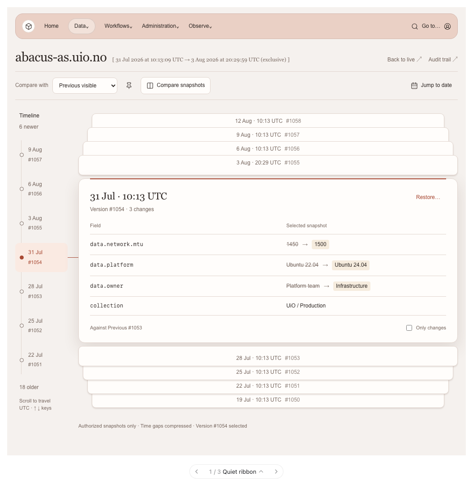
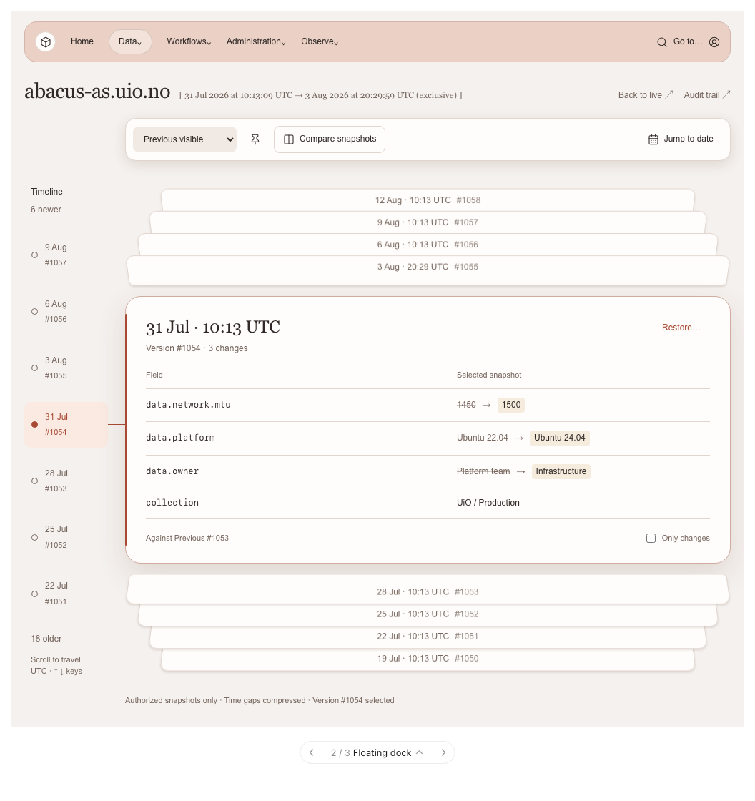
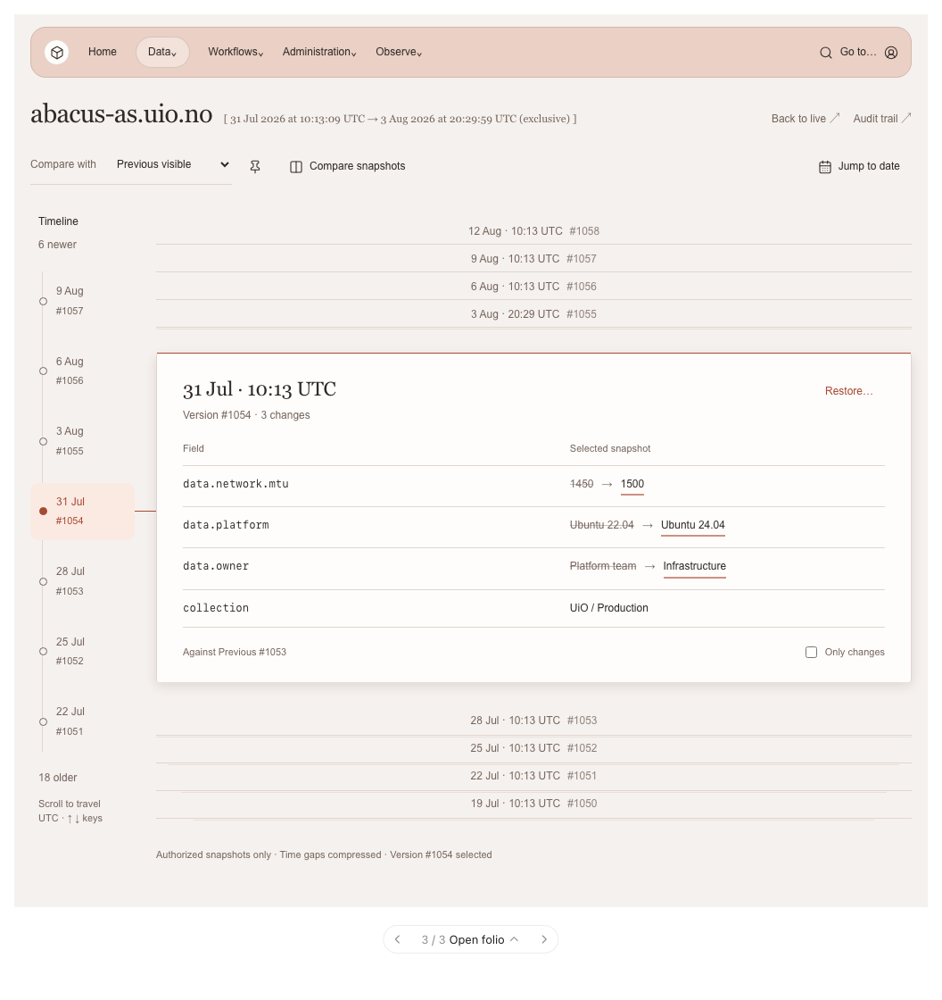

# History stack design alternatives

These proposals refine the implemented history browser in issues
[#143](https://github.com/hubuum/hubuum-frontend/issues/143) and
[#144](https://github.com/hubuum/hubuum-frontend/issues/144). **Quiet ribbon** is
the selected treatment, now applied to the application. Class restoration remains
a separate follow-up in [#145](https://github.com/hubuum/hubuum-frontend/issues/145).

Open [preview.html](preview.html) locally in a browser to switch concepts, scroll
the timeline, pin a baseline, change comparison modes, and jump to a date. The
preview uses illustrative data and performs no backend requests or writes.
The restore control demonstrates entering a review, without an apply action.

## Shared direction

Move comparison controls into a shared toolbar to the left of **Jump to date**.
Replace the repeated resource name inside the selected card with its timestamp
and version. Use a compact pin action and quieter restore action. Preserve the
inline effective range, full-height timeline, loaded-version counts, and four
centered version titles above and below the selected snapshot.

## Quiet ribbon

Selected treatment: a simple toolbar across the page, restrained depth,
and one fine accent line on the selected card. This keeps controls accessible
while giving the snapshot most of the visual emphasis.

## Floating dock

Group the controls into a raised toolbar aligned with the card stack. Perspective
on the neighboring sheets and a side accent give the selected card more depth.
This retains the strongest sense of moving through a physical stack.

## Open folio

Use minimal controls, flat neighboring rows, and a paper-like selected snapshot.
Underlined changes replace filled highlights. This is the quietest reading view,
with less emphasis on physical depth.

## Implementation

Quiet ribbon is implemented in `src/components/resource-history-browser.tsx`,
`src/components/history-stack-navigation.tsx`, and
`src/components/resource-history.module.css`. Comparison controls share a
page-wide ribbon to the left of **Jump to date**. The selected card leads with
its timestamp and version, with a compact pin control in the ribbon, a quieter
restore action, neutral neighboring sheets, and a fine accent line. The existing
comparison, restore, URL, keyboard, and pagination behavior is retained.

Floating dock and Open folio remain design alternatives in the standalone preview.

The previews were checked at 320, 736, and 1024 pixels in light and dark themes.
Local interactions for wheel/keyboard navigation, Previous/Live/Pinned baselines,
expanded comparison, changed fields, date jumps, and restore review were checked.
